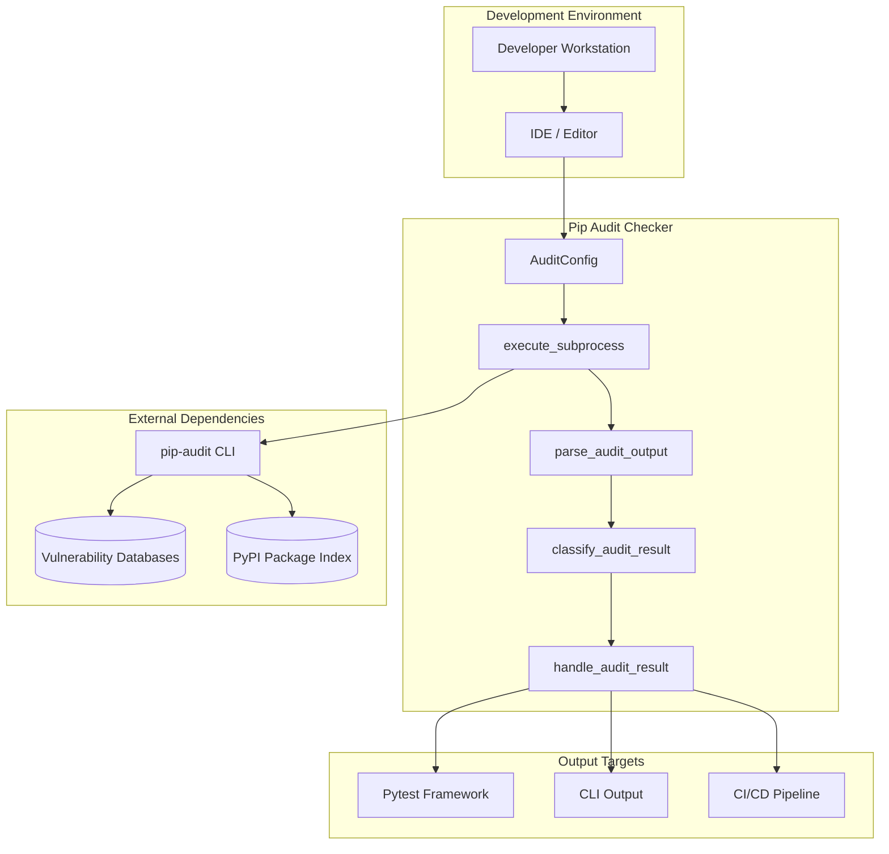
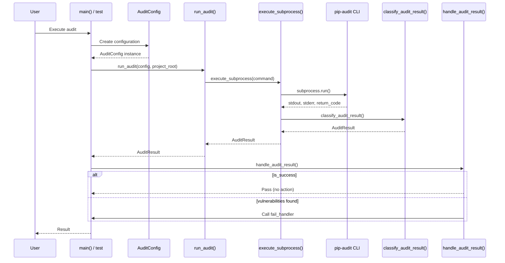
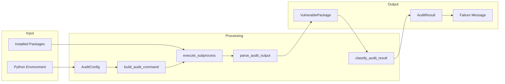
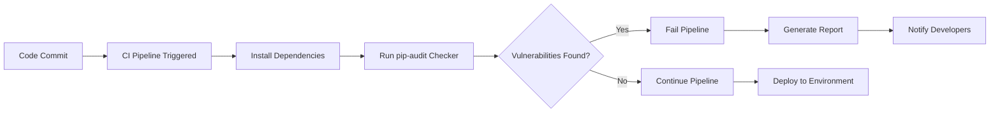

[](https://www.python.org/downloads/)
[](https://aws.amazon.com/cdk/)
[](https://github.com/PyCQA/bandit)
[](https://github.com/pre-commit/pre-commit)
[](https://github.com/bwhmather/ssort)
[](https://github.com/charliermarsh/ruff-pre-commit)
[](https://github.com/pre-commit/mirrors-mypy)
[](https://github.com/Zac-HD/shed)
[](https://github.com/rubik/xenon)
[](https://github.com/gitleaks/gitleaks)
[](https://github.com/PyCQA/bandit)
[](https://github.com/hadolint/hadolint)
[](https://github.com/Yelp/detect-secrets)
[](https://github.com/owenlamont/uv-secure)
[](https://github.com/hukkin/mdformat)

# Pip Audit Checker Service Documentation

## Introduction

The **Pip Audit Checker** is a security audit utility that leverages [pip-audit](https://github.com/pypa/pip-audit) to detect known vulnerabilities in Python packages. This module provides functional, composable security audit utilities designed for Python 3.13+ with functional programming principles, high cohesion, and low coupling.

The service integrates seamlessly into CI/CD pipelines and development workflows, providing automated security scanning of Python dependencies against known vulnerability databases including the [Python Packaging Advisory Database](https://github.com/pypa/advisory-database) and the [OSV (Open Source Vulnerabilities)](https://osv.dev/) database.

## Table of Contents

- [Introduction](#introduction)
- [Architecture](#architecture)
- [Overview](#overview)
  - [Purpose](#purpose)
  - [Target Audience](#target-audience)
  - [Business Value](#business-value)
- [Use Case](#use-case)
- [Stories](#stories-user-operational-and-technical)
- [Requirements](#requirements)
- [Implementation](#implementation)
- [API Reference](#api-reference)
- [Monitoring](#monitoring)
- [Security & Privacy](#security--privacy)
- [Troubleshooting](#troubleshooting)
- [Operational Guidelines](#operational-guidelines)
- [Glossary](#glossary)
- [References](#references)

## Architecture

### High-Level Architecture Overview



### Component Flow Diagram



### Data Flow Diagram



## Overview

### Purpose

The Pip Audit Checker serves as the primary security gate for Python dependency management within the cdk-opinionated-constructs project. It provides:

1. **Automated Vulnerability Detection**: Scans installed Python packages against known vulnerability databases
2. **CI/CD Integration**: Seamless integration with pytest for automated pipeline execution
3. **Configurable Scanning**: Customizable ignore lists and timeout settings
4. **Clear Reporting**: Structured JSON output with detailed vulnerability information
5. **Functional Design**: Pure functions and immutable data structures for reliability and testability

### Target Audience

| Audience                   | Use Case                                            |
| -------------------------- | --------------------------------------------------- |
| **Cloud/DevOps Engineers** | Integrate security scanning into CI/CD pipelines    |
| **Security Engineers**     | Audit Python dependencies for known vulnerabilities |
| **Software Developers**    | Identify vulnerable packages during development     |
| **Technical Architects**   | Design secure dependency management strategies      |
| **Compliance Officers**    | Verify security controls are in place               |

### Business Value

- **Risk Mitigation**: Proactively identify and address known vulnerabilities before deployment
- **Compliance**: Support security compliance requirements (SOC 2, ISO 27001, PCI-DSS)
- **Cost Reduction**: Prevent security incidents through early detection
- **Developer Productivity**: Automated scanning reduces manual security review burden
- **Supply Chain Security**: Protect against compromised third-party dependencies

## Use Case

### Primary Use Case: CI/CD Pipeline Security Gate



### Secondary Use Cases

1. **Local Development Checks**: Run security audits before committing code
2. **Scheduled Audits**: Periodic scanning of deployed environments
3. **Dependency Updates**: Validate security before upgrading packages
4. **Security Incident Response**: Quickly assess exposure to newly disclosed vulnerabilities

## Stories (User, Operational, and Technical)

### User Stories

| ID     | Story                                                                                                           | Acceptance Criteria                                 |
| ------ | --------------------------------------------------------------------------------------------------------------- | --------------------------------------------------- |
| US-001 | As a developer, I want to scan my Python dependencies for vulnerabilities so that I can identify security risks | Audit completes with clear pass/fail result         |
| US-002 | As a developer, I want to ignore known false positives so that the audit doesn't fail on irrelevant issues      | Configuration accepts CVE IDs to ignore             |
| US-003 | As a CI pipeline, I want to fail builds with vulnerabilities so that insecure code isn't deployed               | Non-zero exit code on vulnerabilities               |
| US-004 | As a security engineer, I want detailed vulnerability reports so that I can prioritize remediation              | JSON output with package name, version, and CVE IDs |

### Operational Stories

| ID     | Story                                                                               | Acceptance Criteria                            |
| ------ | ----------------------------------------------------------------------------------- | ---------------------------------------------- |
| OS-001 | As an operator, I want audit timeouts so that hung processes don't block pipelines  | Configurable timeout with graceful handling    |
| OS-002 | As an operator, I want clear error messages so that I can troubleshoot failures     | Distinct status codes and descriptive messages |
| OS-003 | As an operator, I want version checking so that I can verify pip-audit installation | Version command with success/failure status    |

### Technical Stories

| ID     | Story                                                                         | Acceptance Criteria                              |
| ------ | ----------------------------------------------------------------------------- | ------------------------------------------------ |
| TS-001 | As a maintainer, I want immutable data structures so that code is predictable | All dataclasses use `frozen=True`                |
| TS-002 | As a maintainer, I want pure functions so that testing is straightforward     | Functions are deterministic with no side effects |
| TS-003 | As a maintainer, I want type hints so that code is self-documenting           | Full type coverage with mypy validation          |

## Requirements

### Functional

| ID     | Requirement                                  | Priority    |
| ------ | -------------------------------------------- | ----------- |
| FR-001 | Execute pip-audit against installed packages | Must Have   |
| FR-002 | Parse JSON output into structured data       | Must Have   |
| FR-003 | Support vulnerability ignore lists           | Must Have   |
| FR-004 | Provide pytest integration                   | Must Have   |
| FR-005 | Support CLI execution mode                   | Should Have |
| FR-006 | Validate pip-audit installation              | Should Have |
| FR-007 | Support configurable output formats          | Could Have  |

### Non-functional

| ID      | Requirement          | Target                            |
| ------- | -------------------- | --------------------------------- |
| NFR-001 | Execution timeout    | Default 120 seconds, configurable |
| NFR-002 | Memory usage         | < 100MB during audit              |
| NFR-003 | Python version       | 3.13+ required                    |
| NFR-004 | Dependency footprint | Minimal (pytest only for tests)   |
| NFR-005 | Code coverage        | > 90% unit test coverage          |

## Implementation

### Technology Stack

| Component         | Technology   | Purpose                       |
| ----------------- | ------------ | ----------------------------- |
| **Runtime**       | Python 3.13+ | Core programming language     |
| **Audit Tool**    | pip-audit    | Vulnerability scanning engine |
| **Testing**       | pytest       | Test framework integration    |
| **Type Checking** | mypy         | Static type analysis          |
| **Linting**       | ruff, bandit | Code quality and security     |

### Core Components

#### AuditConfig

Immutable configuration dataclass for pip-audit execution:

```python
@dataclass(frozen=True, slots=True)
class AuditConfig:
    ignored_vulns: tuple[str, ...] = ("CVE-2025-53000",)
    timeout_seconds: int = 120
    output_format: str = "json"
    disable_spinner: bool = True
```

#### AuditStatus

Enumeration of possible audit result statuses:

```python
class AuditStatus(StrEnum):
    SUCCESS = auto()
    VULNERABILITIES_FOUND = auto()
    PARSE_ERROR = auto()
    TIMEOUT = auto()
    NOT_INSTALLED = auto()
    EXECUTION_ERROR = auto()
```

#### VulnerablePackage

Immutable representation of a vulnerable package:

```python
@dataclass(frozen=True, slots=True)
class VulnerablePackage:
    name: str
    version: str
    vulnerabilities: tuple[str, ...]
```

#### AuditResult

Immutable result of a pip-audit execution:

```python
@dataclass(frozen=True, slots=True)
class AuditResult:
    status: AuditStatus
    vulnerable_packages: tuple[VulnerablePackage, ...] = field(default_factory=tuple)
    raw_output: str = ""
    error_output: str = ""
    return_code: int = 0
```

### Usage Examples

#### Running as Pytest Test

```bash
# Activate virtual environment
source .venv/bin/activate

# Run the vulnerability audit test
uv run pytest cdk_opinionated_constructs/utils/pip_audit_files/pip_audit_checker.py::test_pip_audit_no_vulnerabilities -v
```

#### Running as CLI

```bash
# Activate virtual environment
source .venv/bin/activate

# Run directly
uv run python cdk_opinionated_constructs/utils/pip_audit_files/pip_audit_checker.py
```

#### Programmatic Usage

```python
from pathlib import Path

from pip_audit_checker import (
    AuditConfig,
    handle_audit_result,
    run_audit,
)

# Create custom configuration
config = AuditConfig(
    ignored_vulns=("CVE-2025-53000", "CVE-2024-12345"),
    timeout_seconds=180,
)

# Run the audit
project_root = Path("/path/to/project")
result = run_audit(config, project_root)

# Check results
if result.is_success:
    print("No vulnerabilities found!")
else:
    print(f"Found {result.vulnerability_count} vulnerable packages")
    print(result.format_vulnerabilities())
```

## API Reference

### Functions

#### `build_audit_command(python_executable: str, config: AuditConfig) -> list[str]`

Builds the pip-audit command with all arguments.

**Parameters:**

- `python_executable`: Path to Python interpreter
- `config`: Audit configuration

**Returns:** Complete command as list of strings

______________________________________________________________________

#### `parse_audit_output(stdout: str) -> tuple[VulnerablePackage, ...]`

Parses pip-audit JSON output into VulnerablePackage instances.

**Parameters:**

- `stdout`: Raw JSON output from pip-audit

**Returns:** Tuple of VulnerablePackage instances

**Raises:** `json.JSONDecodeError` if stdout is not valid JSON

______________________________________________________________________

#### `classify_audit_result(return_code: int, stdout: str, stderr: str) -> AuditResult`

Classifies subprocess result into typed AuditResult.

**Parameters:**

- `return_code`: Process return code
- `stdout`: Standard output
- `stderr`: Standard error

**Returns:** Classified AuditResult with appropriate status

______________________________________________________________________

#### `execute_subprocess(command: Sequence[str], *, cwd: Path | None = None, timeout: int = 120) -> AuditResult`

Executes subprocess and returns typed result.

**Parameters:**

- `command`: Command and arguments to execute
- `cwd`: Working directory for subprocess
- `timeout`: Timeout in seconds

**Returns:** AuditResult with appropriate status

______________________________________________________________________

#### `run_audit(config: AuditConfig, project_root: Path) -> AuditResult`

Executes pip-audit with given configuration.

**Parameters:**

- `config`: Audit configuration
- `project_root`: Project root directory

**Returns:** AuditResult from the audit execution

______________________________________________________________________

#### `handle_audit_result(result: AuditResult, config: AuditConfig, fail_handler: Callable[[str], NoReturn]) -> None`

Handles audit result, calling fail_handler if not successful.

**Parameters:**

- `result`: The audit result to handle
- `config`: The audit configuration used
- `fail_handler`: Function to call on failure (e.g., pytest.fail)

______________________________________________________________________

#### `check_pip_audit_version() -> AuditResult`

Checks if pip-audit is installed and functional.

**Returns:** AuditResult indicating installation status

## Monitoring

### Key Metrics

| Metric                 | Description                    | Target       |
| ---------------------- | ------------------------------ | ------------ |
| Audit Duration         | Time to complete security scan | < 60 seconds |
| Vulnerability Count    | Number of vulnerable packages  | 0            |
| False Positive Rate    | Ignored vulnerabilities ratio  | < 5%         |
| Execution Success Rate | Successful audit completions   | > 99%        |

### Monitoring Best Practices

1. **Track audit duration trends** to identify performance degradation
2. **Monitor vulnerability counts** over time for security posture visibility
3. **Alert on repeated failures** to catch environment issues
4. **Log ignored vulnerabilities** for audit trails

### Integration with CI/CD

```yaml
# Example GitHub Actions integration
- name: Run Security Audit
  run: |
    source .venv/bin/activate
    uv run pytest cdk_opinionated_constructs/utils/pip_audit_files/pip_audit_checker.py -v
  continue-on-error: false
```

## Security & Privacy

### Security Controls Matrix

| Control                      | Implementation                       | Status         |
| ---------------------------- | ------------------------------------ | -------------- |
| Command Injection Prevention | List-based subprocess arguments      | ✅ Implemented |
| Safe JSON Parsing            | `json.loads()` only (no eval/pickle) | ✅ Implemented |
| Path Traversal Prevention    | `pathlib.Path` with restricted paths | ✅ Implemented |
| Immutable Configuration      | `frozen=True` dataclasses            | ✅ Implemented |
| Timeout Protection           | Configurable subprocess timeout      | ✅ Implemented |
| Input Validation             | Type hints and runtime validation    | ✅ Implemented |

### Security Assessment Summary

A comprehensive white-box security assessment found **no high or critical severity vulnerabilities**. The codebase demonstrates strong security practices:

- **Subprocess Execution**: Uses list arguments with `shell=False`
- **Data Serialization**: Safe JSON handling only
- **Path Handling**: Uses `pathlib.Path` for safe path operations
- **Configuration Management**: Immutable dataclasses with frozen=True

For full details, see [penetration_test_report.md](penetration_test_report.md).

### Privacy Considerations

- No sensitive data is collected or transmitted
- Audit results remain local unless explicitly shared
- Package names and versions are the only data processed
- No telemetry or analytics are implemented

## Troubleshooting

### Common Issues and Solutions

#### pip-audit Not Installed

**Symptom:** `AuditStatus.NOT_INSTALLED` returned

**Solution:**

```bash
source .venv/bin/activate
uv pip install pip-audit
```

#### Timeout During Audit

**Symptom:** `AuditStatus.TIMEOUT` returned

**Solutions:**

1. Increase timeout in configuration:
   ```python
   config = AuditConfig(timeout_seconds=300)
   ```
2. Check network connectivity to PyPI and vulnerability databases
3. Reduce number of installed packages in environment

#### Parse Error

**Symptom:** `AuditStatus.PARSE_ERROR` returned

**Solutions:**

1. Verify pip-audit outputs valid JSON:
   ```bash
   source .venv/bin/activate
   uv run python -m pip_audit --format=json
   ```
2. Check for pip-audit version compatibility
3. Update pip-audit to latest version

#### Vulnerabilities Found (Expected)

**Symptom:** `AuditStatus.VULNERABILITIES_FOUND` returned

**Solutions:**

1. Review the vulnerability details in the output
2. Update affected packages if patches are available
3. Add CVE IDs to `ignored_vulns` if false positive or accepted risk:
   ```python
   config = AuditConfig(ignored_vulns=("CVE-2025-53000", "CVE-XXXX-XXXXX"))
   ```

### Debug Commands

```bash
# Check pip-audit version
source .venv/bin/activate
uv run python -m pip_audit --version

# Run audit manually with verbose output
uv run python -m pip_audit --format=json --progress-spinner=off

# Run with specific ignore
uv run python -m pip_audit --ignore-vuln CVE-2025-53000 --format=json
```

### Pipeline Troubleshooting

| Issue                | Possible Cause           | Solution                                   |
| -------------------- | ------------------------ | ------------------------------------------ |
| Build fails on audit | Vulnerabilities detected | Update packages or add to ignore list      |
| Audit hangs          | Network issues           | Check firewall rules and proxy settings    |
| Import errors        | Missing dependencies     | Run `make install` to install dependencies |
| Permission denied    | File system access       | Check virtual environment activation       |

## Operational Guidelines

### Installation

```bash
# Clone the repository
git clone git@github.com:airmonitor/cdk-opinionated-constructs.git
cd cdk-opinionated-constructs

# Create and activate virtual environment
make venv
source .venv/bin/activate

# Install dependencies
make install
```

### Regular Maintenance

| Task                | Frequency    | Command                              |
| ------------------- | ------------ | ------------------------------------ |
| Update pip-audit    | Monthly      | `uv pip install --upgrade pip-audit` |
| Review ignored CVEs | Quarterly    | Review `DEFAULT_CONFIG` in source    |
| Update dependencies | Monthly      | `make update`                        |
| Run security audit  | Every commit | Automated via CI/CD                  |

### Configuration Management

The default configuration is defined as a module-level constant:

```python
DEFAULT_CONFIG: Final[AuditConfig] = AuditConfig()
```

To customize configuration for specific environments:

1. **Development**: Use default configuration
2. **CI/CD**: Override timeout for faster feedback
3. **Production audits**: Use stricter settings with no ignores

## Glossary

| Term                    | Definition                                                                            |
| ----------------------- | ------------------------------------------------------------------------------------- |
| **CVE**                 | Common Vulnerabilities and Exposures - unique identifier for security vulnerabilities |
| **pip-audit**           | Python package auditing tool that scans dependencies for known vulnerabilities        |
| **OSV**                 | Open Source Vulnerabilities - a distributed vulnerability database                    |
| **PyPI**                | Python Package Index - the official repository for Python packages                    |
| **Supply Chain Attack** | Attack targeting software dependencies rather than direct application code            |
| **False Positive**      | A vulnerability reported that is not actually exploitable in context                  |
| **SBOM**                | Software Bill of Materials - inventory of software components                         |
| **Dataclass**           | Python decorator for creating classes that primarily store data                       |
| **Frozen Dataclass**    | Immutable dataclass where attributes cannot be modified after creation                |
| **Pure Function**       | Function that always produces the same output for the same input with no side effects |

## References

### Source Files

| File                                                                                        | Purpose                |
| ------------------------------------------------------------------------------------------- | ---------------------- |
| `cdk_opinionated_constructs/utils/pip_audit_files/pip_audit_checker.py`                     | Main implementation    |
| `cdk_opinionated_constructs/utils/pip_audit_files/__init__.py`                              | Package initialization |
| `test/unit/test_pip_audit_checker.py`                                                       | Unit tests             |
| `cdk_opinionated_constructs/utils/pip_audit_files/documentation/home.md`                    | This documentation     |
| `cdk_opinionated_constructs/utils/pip_audit_files/documentation/penetration_test_report.md` | Security assessment    |

### External Resources

- [pip-audit Documentation](https://github.com/pypa/pip-audit)
- [Python Packaging Advisory Database](https://github.com/pypa/advisory-database)
- [OSV (Open Source Vulnerabilities)](https://osv.dev/)
- [CVE Database](https://cve.mitre.org/)
- [OWASP Dependency-Check](https://owasp.org/www-project-dependency-check/)

### Project Resources

- [Main Repository README](../../../../README.md)
- [Project Makefile](../../../../Makefile)
- [Pre-commit Configuration](../../../../.pre-commit-config.yaml)

### Related Standards

- [CWE-1035: OWASP Top Ten 2017 - A9 Using Components with Known Vulnerabilities](https://cwe.mitre.org/data/definitions/1035.html)
- [NIST SP 800-53 Rev. 5 - SI-2 Flaw Remediation](https://csrc.nist.gov/publications/detail/sp/800-53/rev-5/final)
- [ISO 27001:2022 - A.8.28 Secure Coding](https://www.iso.org/standard/27001)
